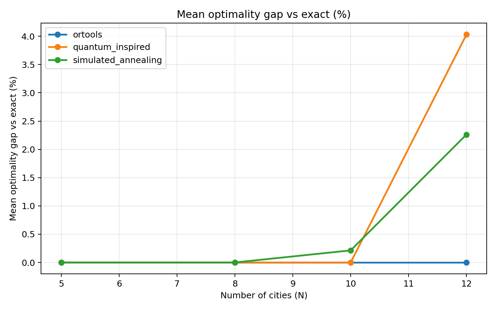
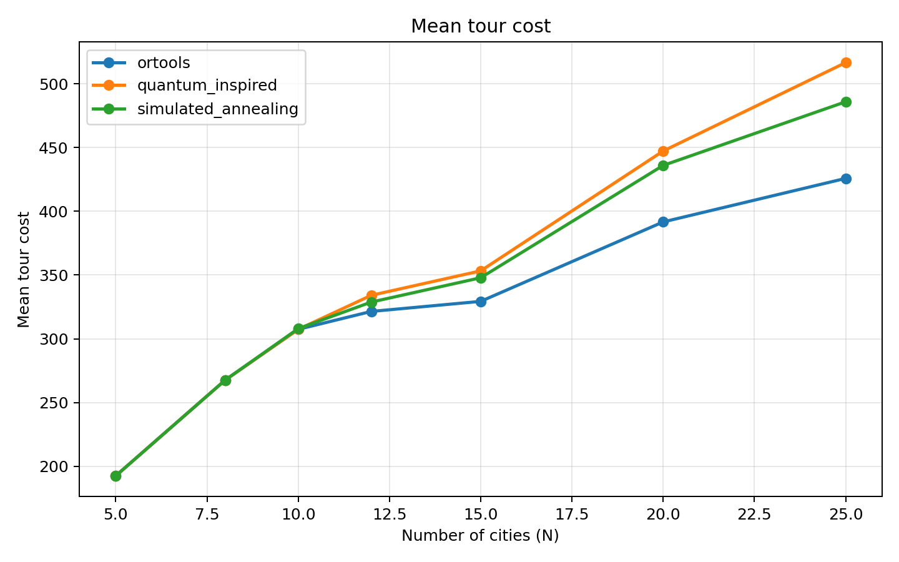
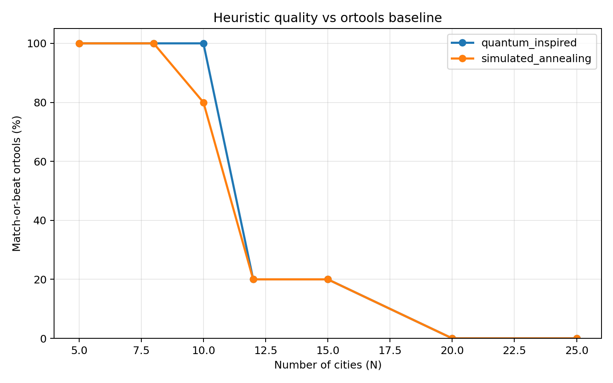
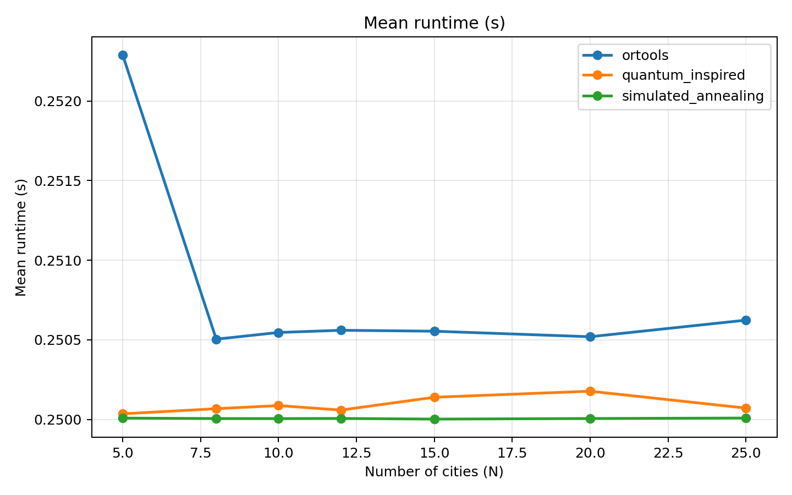

# Quantum-Classical Benchmark

[](https://github.com/DheerajRam12262/quantum-classical-benchmark/actions/workflows/ci.yml)
[](https://www.python.org/)
[](LICENSE)
[](https://github.com/psf/black)
[](https://mypy-lang.org/)

A **fair, reproducible benchmark** comparing classical, quantum, and
quantum-inspired optimizers on the Travelling Salesperson Problem (TSP), encoded
as a QUBO, under a **matched per-solver wall-clock budget** with **exact ground
truth** and honest statistics.

> **TL;DR (the honest finding).** On classical hardware, Google OR-Tools reaches
> the exact optimum on every instance tested (≈0% gap). The simulated-annealing
> and quantum-inspired metaheuristics match it only up to ~10 cities, then fall
> behind — and the heavier *quantum-inspired* method degrades **fastest** under a
> tight time budget. The value here is the **methodology**, not a quantum win
> that doesn't exist on a simulator.

This repository deliberately does **not** claim quantum advantage. Saying clearly
where quantum/quantum-inspired methods lose is the point.

---

## Methodology (what makes the comparison fair)

| Principle | How it's enforced |
|---|---|
| **Matched budget** | Every solver gets the *same* wall-clock budget per instance (ms-resolution time limit). |
| **Same instances** | All solvers run on identical seeded Euclidean instances; RNGs are seeded throughout. |
| **Ground truth** | Exact optimum via Held-Karp for N ≤ 12 → a *true* optimality gap, not a relative ranking. |
| **Honest baseline** | The baseline is **OR-Tools** (Guided Local Search), not a deliberately weak solver. Beating a strawman proves nothing. |
| **Repeat + summarize** | Multiple trials per size; report mean ± std, never a single run. |
| **Scaling study** | Sweep N = 5…25; report solution quality, runtime, and cost-scaling exponent. |

The "quantum-inspired" solver is a **classical** parallel-tempering metaheuristic
whose *structure* (a temperature ladder of replicas + an alternating
explore/exploit schedule) is inspired by quantum annealing and QAOA. It is named
honestly: no qubits are involved. A genuine QAOA path (Qiskit, statevector
simulator) is included for small instances to demonstrate a correct
QUBO → Ising → QAOA → decoded-tour pipeline — see [Quantum (QAOA)](#quantum-qaoa-path).

## Results

Canonical run: N = 5…25, 5 trials each, 0.25 s budget per solver. Regenerate with
`make repro` (writes to [results/benchmark/](results/benchmark/)).

**Mean tour cost** (lower is better) and **optimality gap vs exact** (N ≤ 12):

| N | OR-Tools | Simulated Annealing | Quantum-Inspired | OR-Tools gap | SA gap | QI gap |
|--:|--:|--:|--:|--:|--:|--:|
| 5  | 192.5 | 192.5 | 192.5 | 0.00% | 0.00% | 0.00% |
| 8  | 267.6 | 267.6 | 267.6 | 0.00% | 0.00% | 0.00% |
| 10 | 307.4 | 308.0 | 307.4 | 0.00% | 0.21% | 0.00% |
| 12 | **321.4** | 328.8 | 334.1 | 0.00% | 2.26% | 4.03% |
| 15 | **329.3** | 347.9 | 353.3 | — | — | — |
| 20 | **391.7** | 436.0 | 447.3 | — | — | — |
| 25 | **425.8** | 485.9 | 516.6 | — | — | — |

At N = 25, simulated annealing trails OR-Tools by **+14%** and the quantum-inspired
method by **+21%**. Cost-scaling exponents (cost ∝ N^k): OR-Tools **0.47**, SA
**0.56**, quantum-inspired **0.59** — OR-Tools scales best, too.

| Optimality gap vs exact | Solution quality vs N |
|---|---|
|  |  |
| **Match-or-beat OR-Tools** | **Runtime** |
|  |  |

## Quickstart

```bash
python -m venv .venv && source .venv/bin/activate
pip install -e ".[dev,ortools]"     # core + OR-Tools baseline + tooling
make repro                          # regenerate every figure/table above
make check                          # ruff + mypy + pytest (what CI runs)
```

### Run individual pieces

```bash
# 1) generate a seeded instance
qcb-generate --cities 12 --seed 42 --output data/tsp_12.json
# 2) encode as QUBO
qcb-encode-qubo --input data/tsp_12.json --output data/qubo_12.npz
# 3) run a solver under a budget
qcb-sa               --input data/tsp_12.json --time-budget 1.0 --seed 42
qcb-quantum-inspired --input data/tsp_12.json --time-budget 1.0 --seed 42
# 4) full benchmark sweep (override the YAML defaults on the CLI)
python benchmarks/run_benchmark.py --sizes 5 10 15 20 --trials 5 --time-budget 0.25
```

## Project layout

```
src/quantum_classical_benchmark/
├── problems/      # seeded TSP generator + tour helpers
├── encoding/      # TSP → QUBO and the QUBO ↔ Ising conversion
├── solvers/       # exact (Held-Karp), simulated_annealing, ortools, quantum_inspired, qaoa, dwave
├── benchmark/     # the fair harness (matched budget, trials, metrics) + scaling
└── plotting/      # figure generation
benchmarks/        # config.yaml + run_benchmark.py CLI
results/benchmark/ # committed, reproducible figures + CSV/JSON
docs/              # REPORT.md (methodology + results) and DECISIONS.md (trade-offs)
tests/             # a real test per solver + encoding/Ising correctness + harness
```

## Quantum (QAOA) path

`solvers/qaoa.py` builds the **correct** TSP cost Hamiltonian (full Z + ZZ terms
from the QUBO → Ising map — verified against the QUBO objective in the tests) and
runs QAOA on a statevector simulator. The TSP QUBO uses N² binary variables, so an
N-city instance needs **N² qubits**; simulation is exponential, making this
practical only for **N ≤ 4 cities (≤ 16 qubits)**. It is *not* competitive — it
exists to show an honest, correct end-to-end pipeline.

```bash
pip install -e ".[quantum]"   # Qiskit + SciPy
```

## Honest limitations

- **No quantum advantage is claimed or observed.** OR-Tools wins outright; the
  metaheuristics are interesting only as a study of fair-budget trade-offs.
- **Wall-clock results are hardware-dependent** for the time-limited solvers
  (OR-Tools, SA, quantum-inspired). The *trends* reproduce; absolute numbers vary
  with CPU. Seeds make the heuristic move sequences deterministic.
- **QAOA does not scale** beyond tiny instances on a simulator (N² qubits).
- **D-Wave** integration is intentionally stubbed (`solvers/dwave.py`) and
  requires Ocean credentials; it is off by default.
- Scope is **TSP**. VRP is out of scope (see [docs/DECISIONS.md](docs/DECISIONS.md)).

## License

[MIT](LICENSE) © 2026 Dheeraj Lagudu
